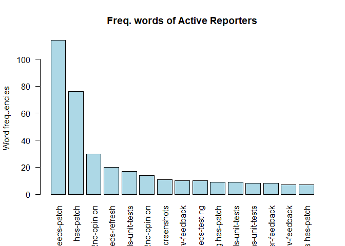
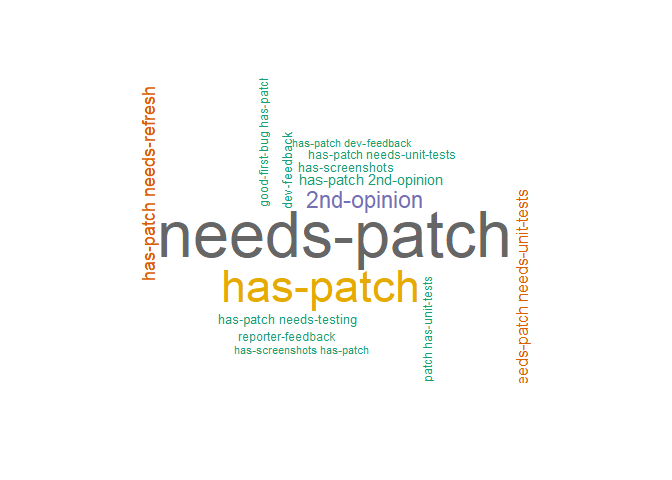
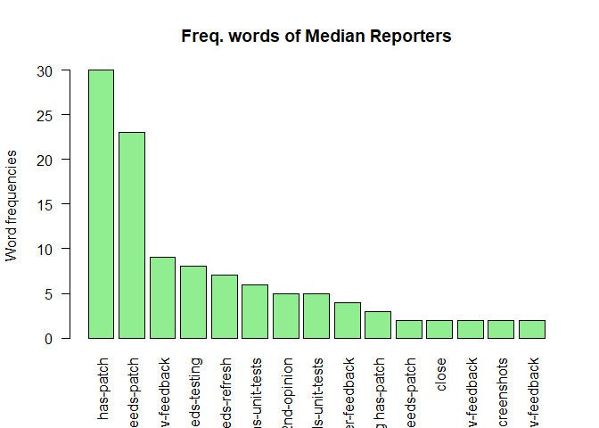
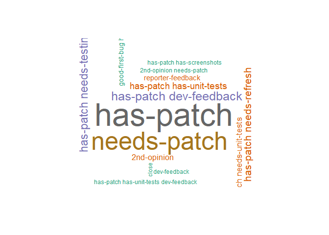
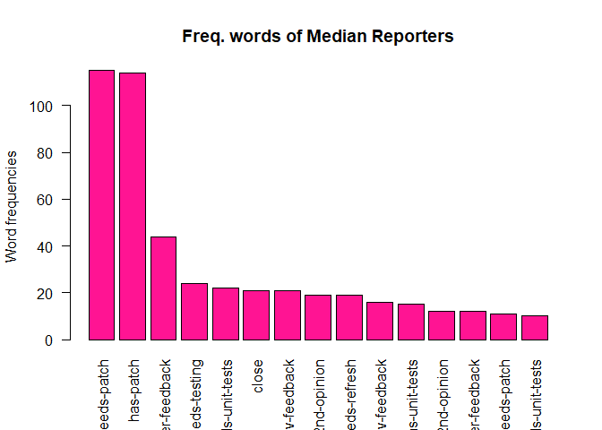
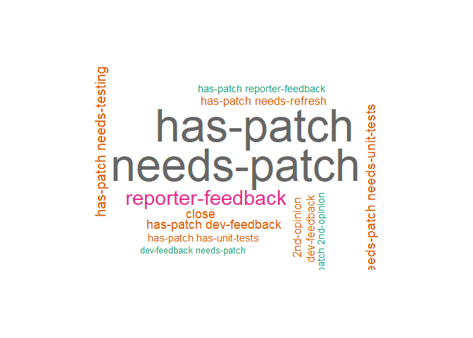

**Type of Analysis:** Descriptive analysis - Bivariate description

**Source:** Data come from WordPress Report Trac System.
[URL Source](https://core.trac.wordpress.org/query?status=accepted&status=assigned&status=new&status=reopened&status=reviewing&col=id&col=summary&col=status&col=owner&col=type&col=priority&col=milestone&col=component&col=version&col=severity&col=resolution&col=time&col=changetime&col=focuses&col=reporter&col=keywords&order=priority)
**Dataframe:** [GitHub Repository](https://raw.githubusercontent.com/vivianesch/CoherenceAnalysisWordPress/master/TicketW.csv)

**Date collection:** 04/07/2019.


**1. EXPLORATORY ANALYSIS -BIVARIABLE ANALYSIS** 


```
## 
## Attaching package: 'dplyr'
```

```
## The following objects are masked from 'package:stats':
## 
##     filter, lag
```

```
## The following objects are masked from 'package:base':
## 
##     intersect, setdiff, setequal, union
```

```
## Loading required package: ggplot2
```

```
## 
## Attaching package: 'plotly'
```

```
## The following object is masked from 'package:ggplot2':
## 
##     last_plot
```

```
## The following object is masked from 'package:stats':
## 
##     filter
```

```
## The following object is masked from 'package:graphics':
## 
##     layout
```


```r
#READ DATA
TicketW <- read_csv('~/PhD Analysis/1. PhD escriptive exploratory analysis/TicketW.csv')
```

```
## Parsed with column specification:
## cols(
##   id = col_double(),
##   Summary = col_character(),
##   Status = col_character(),
##   Version = col_logical(),
##   Owner = col_character(),
##   Type = col_character(),
##   Priority = col_character(),
##   Milestone = col_character(),
##   Component = col_character(),
##   Severity = col_character(),
##   Resolution = col_character(),
##   Created = col_character(),
##   Modified = col_character(),
##   Focuses = col_character(),
##   Reporter = col_character(),
##   Keywords = col_character()
## )
```

```r
View(TicketW) # Read 
glimpse(TicketW)
```

```
## Observations: 2,333
## Variables: 16
## $ id         <dbl> 24579, 30361, 32502, 36441, 40439, 41292, 41886, 41...
## $ Summary    <chr> "Add Drag'n'Drop UI to plugin and theme manual uplo...
## $ Status     <chr> "new", "assigned", "new", "new", "assigned", "reope...
## $ Version    <lgl> NA, NA, NA, NA, NA, NA, NA, NA, NA, NA, NA, NA, NA,...
## $ Owner      <chr> NA, "pento", NA, NA, "mikeschroder", "jnylen0", "me...
## $ Type       <chr> "enhancement", "task (blessed)", "defect (bug)", "d...
## $ Priority   <chr> "high", "high", "high", "high", "high", "high", "hi...
## $ Milestone  <chr> "Future Release", NA, NA, "Future Release", "5.3", ...
## $ Component  <chr> "Upgrade/Install", "General", "Administration", "Cu...
## $ Severity   <chr> "normal", "normal", "major", "normal", "normal", "n...
## $ Resolution <chr> NA, NA, NA, NA, NA, NA, NA, NA, NA, NA, NA, NA, NA,...
## $ Created    <chr> "06/14/2013 05:03:38 PM", "11/17/2014 12:10:55 PM",...
## $ Modified   <chr> "04/12/2019 11:04:54 AM", "06/04/2019 07:42:28 PM",...
## $ Focuses    <chr> NA, "ui, administration", NA, NA, "ui", NA, NA, NA,...
## $ Reporter   <chr> "tw2113", "pento", "ryan", "azaozz", "mikeschroder"...
## $ Keywords   <chr> "ui-feedback ux-feedback needs-patch shiny-updates"...
```


**Functions** 


```r
#Bivariable analysis

#Functions
    #Function .List.f.filter() make variable set that will be filtered
    .List.f.filter = function(x){
        nr<-nrow(x)#Quantity of members
          y<-x[1:nr,1:1] #Select array of members names to filter 
            z<-as.character(y) #Transform names into caracter array
    return(z)
    }
    
    # Function .List.w.Group() Select two key valiables for each group and return a list of inter-ralation of it
    # Where:  x is dataframe with 2 colunms of variables
    # y is a variable yo want to extract a list in order to filter a group
    # f is a list of the group achieve from Function .List.f.filter()
    .Top.15.Group = function(x,y,f){
        z = subset(x, y %in% f) 
        z<-table(z$Keywords,z$Reporter)
          d<-dim(z)
            w<-rowSums(z[1:d[1],1:d[2]])
            w<-as.data.frame(as.table(w)) # Transform to a data frame
            w<- w[order(w$Freq, decreasing = TRUE),] #Ranking
            w<-w[1:15,1:2] #Filter top 10
    return(w)
    }  
```


**1 REPORTERS AND KEYWORDS ANALYSIS:** Reporters are WordPress Community members who find and report a problem from WP Platform, into a Ticket.

**Goal:** Identify the most frequent used to each report member groups (actives, medians, and aliens).


```r
    #1.Analyse Keywords used for Active reporters
    Reporter_Keywords<- TicketW %>% select(Reporter,Keywords) #Table of Reporters and Keywords
    summary(Reporter_Keywords)
```

```
##    Reporter           Keywords        
##  Length:2333        Length:2333       
##  Class :character   Class :character  
##  Mode  :character   Mode  :character
```

```r
    dim(Reporter_Keywords)
```

```
## [1] 2333    2
```

```r
    glimpse(Reporter_Keywords)
```

```
## Observations: 2,333
## Variables: 2
## $ Reporter <chr> "tw2113", "pento", "ryan", "azaozz", "mikeschroder", ...
## $ Keywords <chr> "ui-feedback ux-feedback needs-patch shiny-updates", ...
```

```r
#1.1 Analyse Keywords used for Active reporters
 
     AR<-.List.f.filter(ActiveReporters)
    # 10 top Keywords used by Active Group
Most_Key_AR<-.Top.15.Group(Reporter_Keywords,Reporter_Keywords$Reporter,AR) 

   #1.2 Analyse Keywords used for Median reporters
    MR<-.List.f.filter(MedianReporters)
    # 10 top Keywords used by Median Group
Most_Key_MR<-.Top.15.Group(Reporter_Keywords,Reporter_Keywords$Reporter,MR) 
    
#1.3 Analyse Keywords used for Alien reporters
    LR<-.List.f.filter(LessReporters)
    # 10 top Keywords used by Alien Group 
Most_Key_LR<-.Top.15.Group(Reporter_Keywords,Reporter_Keywords$Reporter,LR) 


library(SnowballC)
library(wordcloud)
```

```
## Loading required package: RColorBrewer
```

```r
library(RColorBrewer)

    #Graphics of most frequent group words 
    #Active Group
  
    barplot(Most_Key_AR$Freq, las = 2, names.arg = Most_Key_AR$Var1,
            col ="lightblue", main ="Freq. words of Active Reporters",
            ylab = "Word frequencies")
```

<!-- -->

```r
    set.seed(1)
    wordcloud(words = Most_Key_AR$Var1, freq = Most_Key_AR$Freq, min.freq = 1,
              max.words=15, random.order=FALSE, rot.per=0.35, 
              colors=brewer.pal(8, "Dark2"))
```

<!-- -->

```r
    #Median Group
    barplot(Most_Key_MR$Freq, las = 2, names.arg = Most_Key_MR$Var1,
            col ="lightgreen", main ="Freq. words of Median Reporters",
            ylab = "Word frequencies")
```

<!-- -->

```r
    set.seed(1)
    wordcloud(words = Most_Key_MR$Var1, freq = Most_Key_MR$Freq, min.freq = 1,
              max.words=15, random.order=FALSE, rot.per=0.35, 
              colors=brewer.pal(8, "Dark2"))
```

<!-- -->

```r
     #Alien Group
    barplot(Most_Key_LR$Freq, las = 2, names.arg = Most_Key_LR$Var1,
            col ="deeppink1", main ="Freq. words of Median Reporters",
            ylab = "Word frequencies")
```

<!-- -->

```r
    set.seed(1)
    wordcloud(words = Most_Key_LR$Var1, freq = Most_Key_LR$Freq, min.freq = 1,
              max.words=14, random.order=FALSE, rot.per=0.35, 
              colors=brewer.pal(8, "Dark2"))
```

<!-- -->


